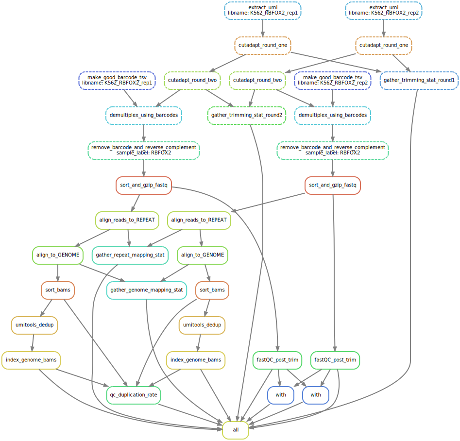
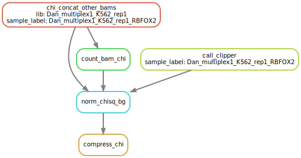
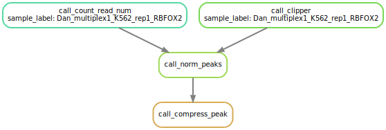
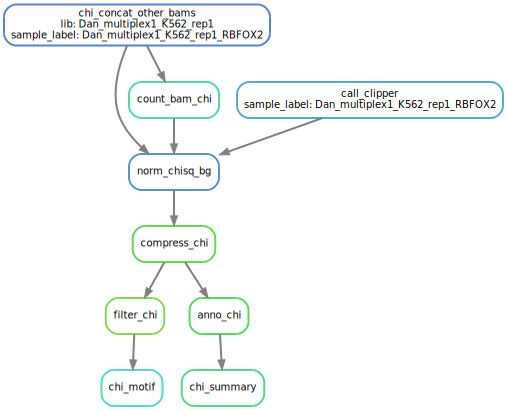
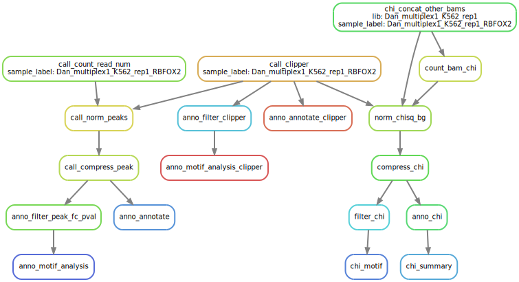

# oligoCLIP
pipeline for oligoCLIP contains 2 stages. `Stage1: SnakeCLIP.py`: Goes from fastq -> bam. `Stage2: SnakePeakMain`: takes bam files for IP and background, perform clipper peak calls, normalization and annotation/motif calling.

# How to run.
- you need to install snakemake and mamba. See [snakemake documentation](https://snakemake.readthedocs.io/en/stable/getting_started/installation.html)

# Stage 1: Preprocessing

## Input: Config file
- fill out the config file. see [example](https://github.com/algaebrown/oligoCLIP/blob/master/eclipse_multi.yaml).
    - `fastq_menifest`: a csv file pointing to 1 or multiple libraries with the *SAME* barcode set. Look at this [example file](https://github.com/algaebrown/oligoCLIP/blob/master/config/fastq_csv/multiplex1.csv) to see how it is structures.
    - `barcode`: a csv file pointing barcodes to RBPs.  The RBP names must be unique. [example](https://github.com/algaebrown/oligoCLIP/blob/master/config/barcode_csv/barcodes.csv)
    - `ADAPTOR_PATH`: a folder containing a "tiling adaptor" fasta file [example](https://github.com/algaebrown/oligoCLIP/blob/master/InvRiL19_adapters.fasta). The adaptor sequence is break into tiling substrings.
    -  `adaptor`: name of the fasta file without the .fasta suffix.
    - `STAR_REP` star indicies build from repbase, used to remove the repetitive sequences. STAR indicies can be build using `--runMode genomeGenerate`. [see STAR documentation](https://physiology.med.cornell.edu/faculty/skrabanek/lab/angsd/lecture_notes/STARmanual.pdf)
    - `STAR_DIR`: is the index built from genome sequences. 
    - `TOOL_PATH`: local directory to this repository
    - `umi_pattern`: `X` for barcode. `N` for UMIs.
    - `WORKDIR`: where you want all outputs saved.
    - `QC_TOOLS_PATH`: paths to python scripts to gather QC outputs. Download [here](https://github.com/algaebrown/QC_tools)
## How to run?
- `snakemake -s snakeCLIP.py -j 12 --keep-going --cluster "qsub -l walltime={params.run_time} -l nodes=1:ppn={params.cores} -q home-yeo" --directory /home/hsher/scratch/ABC_reprocess/ --configfile eclipse_multi.yaml -n` 
    - for specific options, see [snakemake command line interface](https://snakemake.readthedocs.io/en/stable/executing/cli.html)

## Final outputs:
- genome-aligned, de-deduplicated bams: `{libname}/bams/genome/{RBP}.genome-mappedSoSo.rmDupSo.Aligned.out.bam` and its index! `{libname}/bams/genome/{RBP}.genome-mappedSoSo.rmDupSo.Aligned.out.bam.bai`
- repeat-aligned bams: `{libname}/bams/repeat/{RBP}.Aligned.out.bam`
- `QC` folder:
    - `cutadapt_log*.csv`: csv file with all cutadapt statistics joined together
    - `QC/{libname}/fastQC_*.csv`: fastQC outputs for all RBPs.
    - `genome_mapping_stats.csv` and `repeat_mapping_stats.csv`: csv file with all STAR Logs joined together
    - `dup_level.csv`: UMI deduplication statistics
    - I cannot figure out what is going on: chat with your lab's bioinformatician with these files in hand. They will love to see these.

## What is it doing?
the flowchart can be generated using the following command `snakemake -s snakeCLIP.py --dag --configfile config/preprocess_config/eclipse_rbfox.yaml |gdot -Tsvg > snakeCLIP.svg`. You can also run this with your own config file.


1. extract_umi: extracts UMI sequence using umitools. put UMIs into header. The barcodes are still in place.
2. cutadapt_round_one/two: trim 3' adaptor sequences using tiling adaptor sequences (see config).
3. demultuplex_using_barcodes: split RBPs with different barcodes into multiple fastqs.
4. remove_barcode_and_reverse_complement: remove barcode sequence and reverse complement the sequence.
5. sort_and_gzip_fastq: sort fastq and gzip it. 
6. align_reads_to_REPEAT: map to repetitve element database to remove rRNA sequences.
7. align_to_GENOME: map to genome.
8. sort_bams: sort the genome-aligned bam file by coordinate.
9. umitools_dedup: deduplicate based on UMIs.
10. index_genome_bams: index the bam.

### QC rules:
These rules help you diganose problems if the output read is little. 
- gather_timming_stat_round1/2: gather cutadapt output statistics and see how many adaptor/quality-trimmed reads there are. If lots of reads are "too short" after trimming, it can mean lots of adaptor dimer or terrible read quality.
- fastQC_post_trim: run fastQC with the "clean", adaptor- barcode- UMI- free reads. If you see adaptor sequence content here, it means trimming is wrong. Other metrics can be helpful too.
- gather_repeat/genome_mapping_stats: gather STAR .Log.final.out to see what is the unique mapping rate. If you see little reads mapping, check why they are not mapping. Check the unmapped reads by blasting a few of them. 
- qc_duplication_rate: see how many reads are gone by UMI deduplication. If most reads are gone after deduplication, it means library is over-amplified.


# Stage 2: All that peak-calling, normalization and annotations!
## Overview
This main script `Snake_PeakMain.py` calls several modules:
- `rules/clipper_and_norm.py`: fundemental rules to call CLIPper peaks for CLIP library and do ranking based on chi-square/fisher test comparing 1 bam file to *background* bam file. 
- `rules/complementary_control.py`: reuses `rules/clipper_and_norm.py`. Concatenate all other CLIP in the same library into a single bam file as complementary control(CC), and use this as the background bam file.
- `rules/annotate_peak.py`: annotate peaks by region, and find motif with significant peaks.

## Input: Config file
- fill out config file [example](https://github.com/algaebrown/oligoCLIP/blob/master/config/peak_call_config/snake_CLIPper_downsample.yaml)
    - `SCRIPT_PATH`: path to the `scripts/` folder in oligoCLIP
    - `SPECIES`: CLIPper `--species` flag. 
    - `MANIFEST`: [example](https://github.com/algaebrown/oligoCLIP/blob/master/config/peak_call_csv/downsample_peakcall.csv). 
        - `bam_0`: the CLIP bam. This bam will be used to call peaks with CLIPper.
        - `bam_control_0`: the background bam (external normalization). Can be RNA-seq, IgG library and SM-INPUT. In the paper, we showed RNA-seq is not a good control.
        -  All bams must be indexed (ideally outputs from Stage 1)
        - `uid`: the unique ID for each IP-background pair. 
        - `lib`: Dictates the *complementary control* behaviour. Specifies which `bam_0` CLIP is grouped in the same multiplexed library. All other bams in the same `lib` will be used as the *complemetnary control*.
    - `WORKDIR`: working directory. Where you want all files stored
    - `GTF`: *.gtf.db annotation used by [annotator](https://github.com/byee4/annotator). 
    - `ANNOTATOR_SPECIES`: species name used by [annotator](https://github.com/byee4/annotator).
    - `GENOMEFA`: fasta file containing genome sequence. 
    - `CLIPper_pvalthes`: pvalue threshold to filter CLIPper, used by motif calling. All peaks above this threshold will be used to find motif.

## Output:
### Peak calling and Normalization Outputs:
- `output/CLIPper/{uid}.peaks.bed`: CLIPper outputs. "Unnormalized" peaks.
- `output/{uid}.peaks.normed.compressed.bed`: normalized to external control `bam_control_0`.
- `chisq/{lib}/{uid}.peaks.normed.compressed.bed `: normalized to complementary control (all other CLIP in the same library).

### Other Outputs
- `*annotate.bed`: contains the gene, region for each peak.
- `*.summary`: summary of region distribution for all significant peaks.
- `*.svg`: homer motifs figures partitioned by region.

## What is the pipeline doing?
Since the either flowchart will be a hairball, let me highlight each steps.

### Statistical tests used:
1. CLIPper: CLIPper p-value is calculated with Poisson distribution. Background rate is estimated from +/- 500 b.p. from the called peaks. To understand what CLIPper is doing, [please visit CLIPper](https://github.com/YeoLab/clipper)
2. Ranking/normalizing CLIPper peaks with a "background": `scripts/overlap_peakfi_with_bam.pl` is the script that does the job. Given a CLIP bam with a "background" bam with CLIPper beds, it counts how many read CLIP/background falls inside/outside the peak and make a contingency table. If any of the counts < 5, uses Fisher Exact Test. Else it uses chi-square test.

### Complementary control
The following flow chart can be generated with:
```
snakemake -s Snake_PeakMain.py --configfile config/peak_call_config/snake_CLIPper_downsample.chi.yaml --use-conda -n --dag chisq/Dan_multiplex1_K562_rep1_RBFOX2.peaks.normed.compressed.bed| dot -Tsvg > CC.svg
```

1. `concat_all_other_bams`: concatenate all other bams (`bam_0`) in the same library (`lib`) to be used as the complementary control.
2. `count_bam_chi`: count the total number of reads
3. `norm_chisq_bg`: perform prioritization with the CLIP (`bam_0`), with complementary control as background.
4. `compress*`: merge book-ended peaks. P-value and fold-change are from the strongest (lowest p-value) peak being merged.

### External control (with `bam_control_0`)
The following flow chart can be generated with:
```
snakemake -s Snake_PeakMain.py --configfile config/peak_call_config/snake_CLIPper_downsample.chi.yaml --use-conda -n --dag "output/Dan_multiplex1_K562_rep1_RBFOX2.peaks.normed.compressed.bed" | dot -Tsvg > External.svg
```

All is the same as complementary control, except it uses an external bam (`bam_control_0`) file as background.

2. `call_count_read_num`: count the total number of reads. 
3. `norm_chisq_bg`: perform prioritization with the CLIP (`bam_0`), with an external bam (`bam_control_0`) file as background.
4. `compress*`: merge book-ended peaks. P-value and fold-change are from the strongest (lowest p-value) peak being merged.

### Annotation, motifs and summary
The following flow chart can be generated with:
```
snakemake -s Snake_PeakMain.py --configfile config/peak_call_config/snake_CLIPper_downsample.chi.yaml --use-conda -n --dag chisq/motif/Dan_multiplex1_K562_rep1/Dan_multiplex1_K562_rep1_RBFOX2.peaks.normed.compressed.filtered.annotate.svg chisq/Dan_multiplex1_K562_rep1/Dan_multiplex1_K562_rep1_RBFOX2.peaks.summary | dot -Tsvg > anno.svg
```


I use the complementary control as an example. The method used for external control or the unnormalized is the sname.The upper part up to "compress" is already explained above.
1. `filter*`: filter for significant peaks
2. `*motif`: call HOMER motifs for each steps
3. `anno*`: annotate peaks with region, gene name
4. `*summary`: count region distribution for singificant peaks. `scripts/summarize_peak.py` does the job.

### Combining all in place:
```
snakemake -s Snake_PeakMain.py --configfile config/peak_call_config/snake_CLIPper_downsample.chi.yaml \
--use-conda -n --dag \
chisq/Dan_multiplex1_K562_rep1/Dan_multiplex1_K562_rep1_RBFOX2.peaks.summary \
chisq/motif/Dan_multiplex1_K562_rep1/Dan_multiplex1_K562_rep1_RBFOX2.peaks.normed.compressed.filtered.annotate.svg \
output/Dan_multiplex1_K562_rep1_RBFOX2.peaks.normed.compressed.annotate.bed \
output/motif/Dan_multiplex1_K562_rep1_RBFOX2.peaks.normed.compressed.filtered.annotate.svg \
output/CLIPper/Dan_multiplex1_K562_rep1_RBFOX2.peaks.filtered.svg \
output/CLIPper/Dan_multiplex1_K562_rep1_RBFOX2.peaks.annotate.bed \
  | dot -Tsvg > all.svg
```
